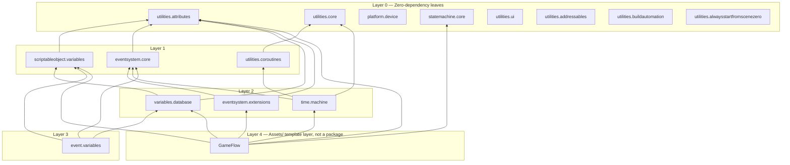

# Architecture Overview

← [[Home]]

## The SOAP pattern

This repository's packages implement **ScriptableObject Architecture (SOAP)**: shared state and cross-system communication go through ScriptableObject assets — variables, events, state machines — instead of singletons, service locators, or scene lookups. Two systems that never reference each other directly can still communicate by sharing a `GameEvent` or `Int` asset.

`AGENTS.md`'s "Change Discipline" states the rule this repo enforces on every package: *"Cross-system wiring should be explicit — ScriptableObject references... or constructor injection — never implicit lookups."* Dependency Injection (VContainer) is allowed for genuine services but is not the default; SOAP wiring is preferred wherever it's sufficient.

[[GameFlow (Template Layer)]] used to violate this with an implicit `Resources.Load<FiniteStateMachine>("StateMachine")` fallback — removed in favor of explicit wiring plus a `[RequireReference]`-backed validator (see that note's "Catching missing wiring" section) that catches an unassigned reference without resorting to a runtime lookup.

## Package layers

Packages form a dependency DAG with utilities at the bottom and GameFlow orchestration at the top. Nothing in a lower layer depends on a higher one.

`scriptableobject.variables.extensions` (Array/Vector/Dictionary types) and the standalone editor tools (`utilities.ui`, `utilities.addressables`, `utilities.buildautomation`, `utilities.alwaysstartfromscenezero`) sit alongside this graph — they depend only on Unity/third-party packages (`com.unity.ugui`, `com.unity.addressables`), not on each other.

## Why the layering matters

- **Leaf packages stay dependency-free on purpose.** `utilities.attributes` and `utilities.core` exist specifically so higher packages have something to depend on without dragging in unrelated functionality — see [[Utilities - Attributes]] and [[Utilities - Core]].
- **Legacy singletons are contained, not removed.** `Singleton<T>` / `SingletonPersistent<T>` in [[Utilities - Core]] exist only for interop with `CoroutineHandler` ([[Utilities - Coroutines]]). New code should not reach through them — see that note's "Legacy" section.
- **GameFlow is the composition root.** [[GameFlow (Template Layer)]] is the only thing in this graph that depends on six packages at once — and it's deliberately not a package itself; everything below it is reusable in isolation, but it is the layer that actually wires a game's boot flow together.

## Open architectural questions

Carried from `.agents/CONTEXT.md` (see that file for the current, authoritative list):

- No package has a settled test/publishing convention yet for the intended Verdaccio registry distribution (see [[Contributing]]).

← [[Home]]
